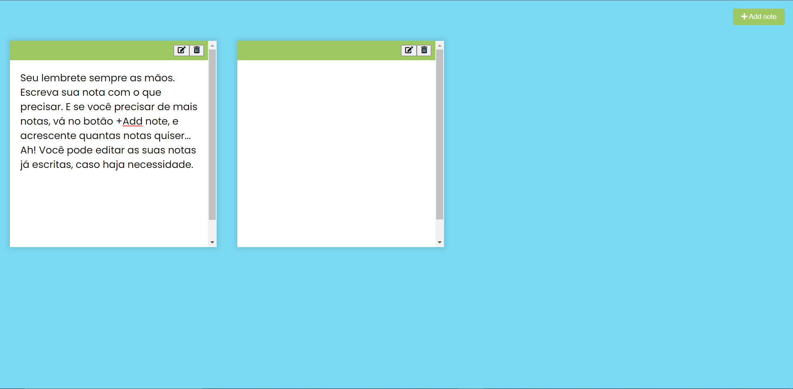

> 💻 Projeto App de Notas

 🔗 [Acesse aqui](https://prdsilva80.github.io/app-de-notas/)

 # 🛠️ Tecnologias Usadas

     

 # 👨‍🎓 O que aprendi

 - Entendi como a Sintaxe é importante para que o html funcione perfeitamente
 - Entendendo melhor o uso do JavaScript
 - Aprendi como buscar a paleta de cores do CSS

 # 📧 Contato

 - probertos717@gmail.com